<div align="center">

<picture>
  <source media="(prefers-color-scheme: dark)" srcset="assets/brand/s3-browser-logo-dark.svg">
  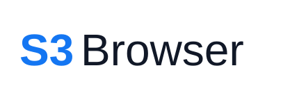
</picture>

**A desktop S3 client in Rust, on [GPUI](https://gpui.rs)** — macOS, Windows, Linux.

[](LICENSE)
[](#status-and-limitations)
[](#status-and-limitations)

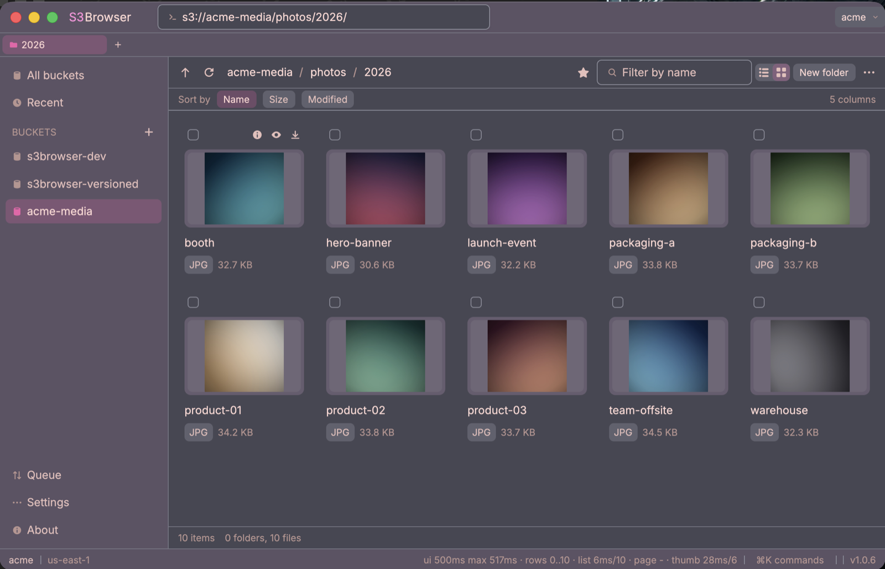

</div>

---

Works with Amazon S3 and with S3-compatible stores — Cloudflare R2, Backblaze
B2, Wasabi, DigitalOcean Spaces, MinIO. "S3-compatible" is treated as a
spectrum, not a checkbox: the app probes what each provider and each token can
actually do, and hides what would only fail.

Secret keys go to the OS credential store (Keychain, Credential Manager,
Secret Service). The config file holds profile metadata and nothing else.

> [!IMPORTANT]
> **Usable, unsigned.** It works and is used against real providers. There are
> no signed binaries, no release automation and no CI — see
> [Status and limitations](#status-and-limitations).

## Features

### Browsing

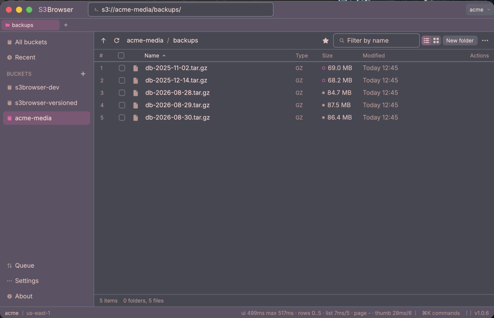

Tabs, breadcrumb, `s3://` path bar, list and grid layouts, pinned and recent
places, an all-buckets page. Listings page as you scroll. Sorting by anything
but name loads the rest of the prefix first, under request and item caps, and
says when it stopped short instead of passing a partial answer off as
complete.

Archived storage classes are marked beside the size, so a Glacier restore is
never a surprise.

### Preview

<table>
<tr>
<td width="50%">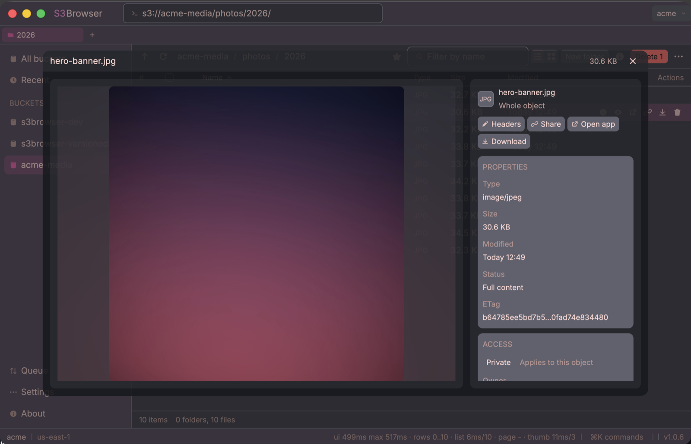</td>
<td width="50%">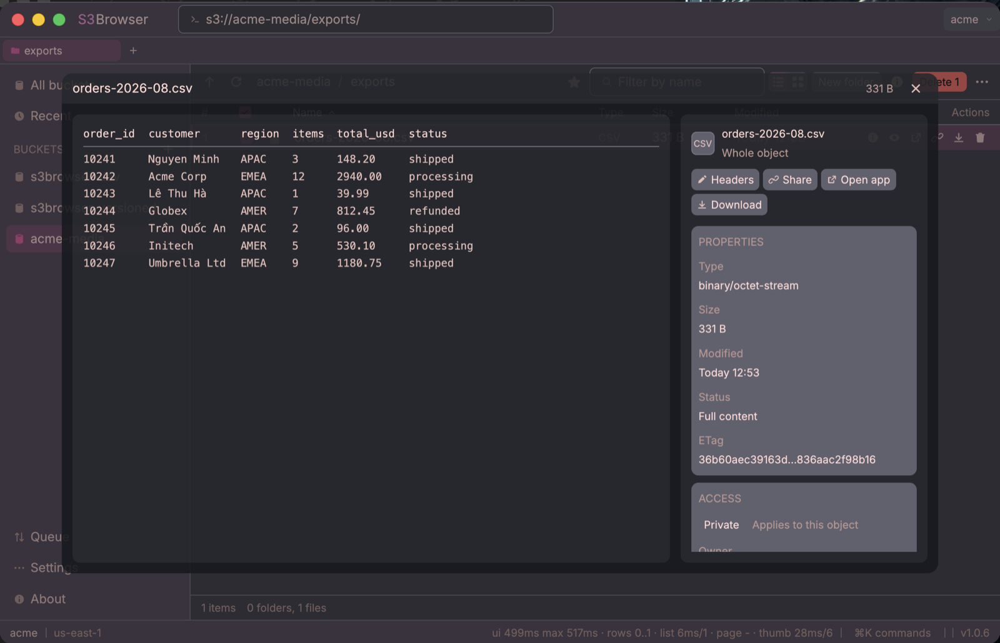</td>
</tr>
</table>

Images, text — editable, saved back — and CSV/TSV as a table via an RFC 4180
parser. Anything else goes to the OS rather than being half-rendered here. The
panel beside it carries size, type, storage class, encryption, ETag and access.

### Sharing and access

<table>
<tr>
<td width="50%">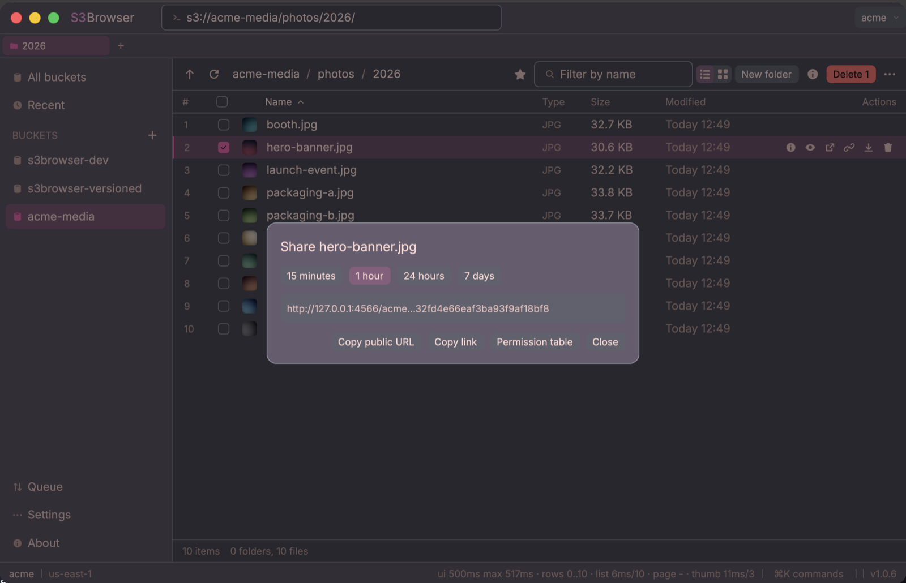</td>
<td width="50%">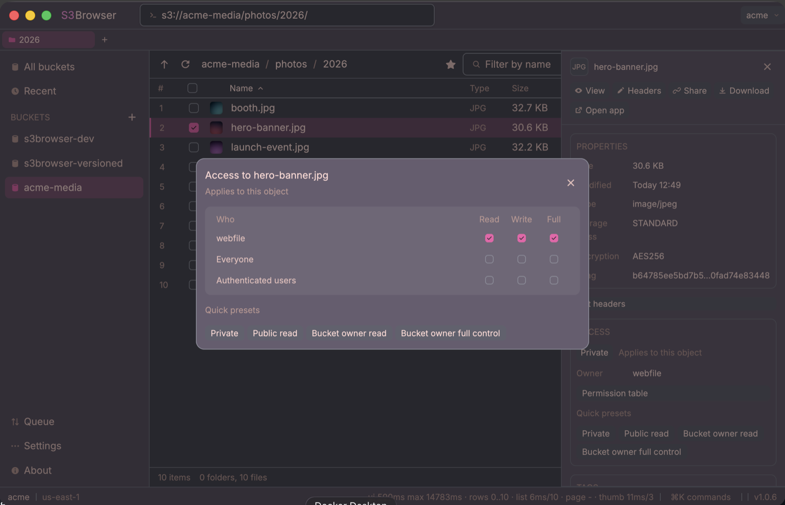</td>
</tr>
</table>

Presigned URLs with expiry presets, and an ACL editor — read, write and full
control per grantee, plus the four canned presets.

### Search

Typing filters what is loaded, for free. Enter scans the whole bucket — one
LIST per thousand keys, so it waits to be asked — with caps, a stop button,
and a status line that separates "finished", "stopped" and "hit the cap".

### Transfers

Upload/download queue with progress, pause, resume and cancel, journalled in
SQLite so it survives a restart. Multipart uploads are implemented directly
rather than through the AWS transfer manager, so a resumed job asks the server
which parts it already holds. Downloads use concurrent ranged GETs pinned to
an ETag, so an interrupted transfer cannot splice two versions together.
Bandwidth throttling and adaptive retry for 503 SlowDown included.

### Object operations

Rename, copy and move (server-side, switching to UploadPartCopy above 5 GiB),
delete with a per-object fallback for stores without `DeleteObjects`,
versioning, tags, storage class and Glacier restore, bulk header editing, and
copying `s3://` paths or bare keys.

### Integrity

CRC32 is sent on upload and verified on download. The ETag is deliberately not
used: for a multipart object it is a digest of digests, so comparing it to a
whole-file hash fails on exactly the large files most worth checking.

### Appearance

<table>
<tr>
<td width="33%">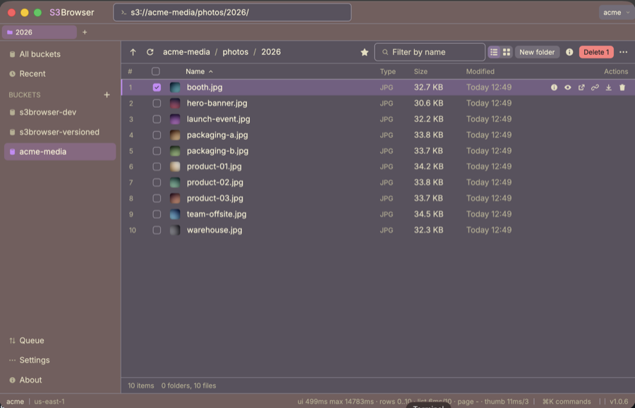</td>
<td width="33%">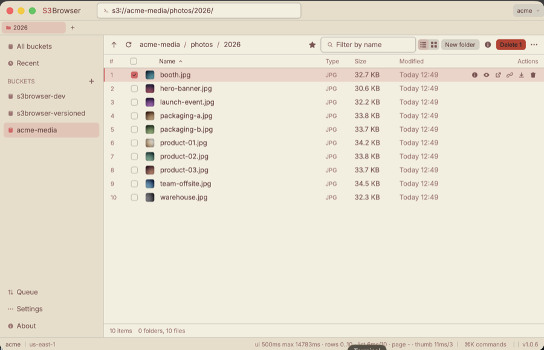</td>
<td width="33%">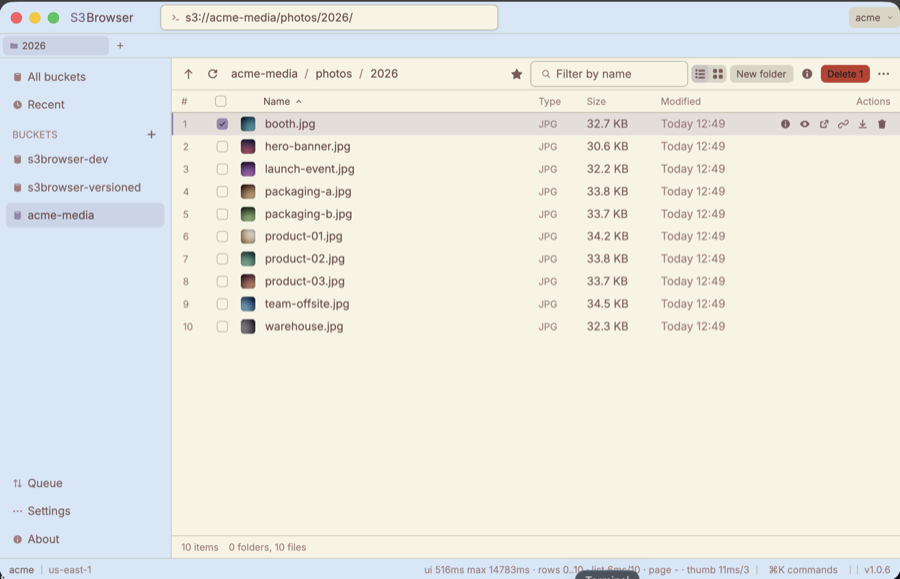</td>
</tr>
</table>

Accent palettes from [Color Hunt](https://colorhunt.co), browsable by
category. The palette sets light or dark; the app otherwise follows the
system.

<table>
<tr>
<td width="50%">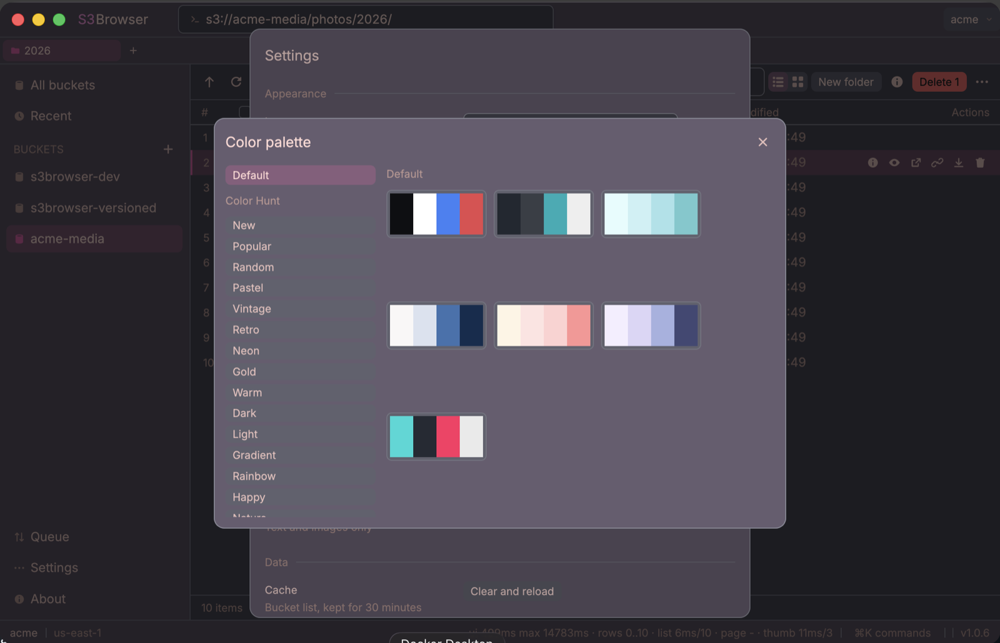</td>
<td width="50%">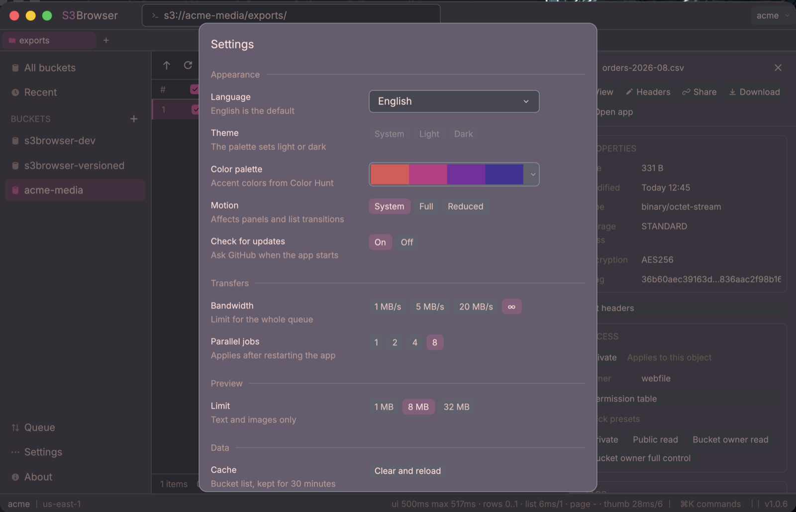</td>
</tr>
</table>

### Command palette

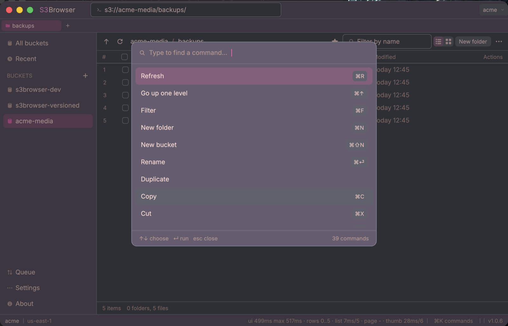

`⌘K` reaches every command, including those without a button; the search
ignores Vietnamese diacritics. The error log keeps the provider's own wording
next to a plain-language summary, and crash reports are written to disk.

## Status and limitations

| | |
|---|---|
| Signed builds | None. macOS Gatekeeper rejects the unsigned `.app`; Developer ID signing and notarisation need a paid Apple Developer account. See [docs/PACKAGING.md](docs/PACKAGING.md). |
| CI and releases | No CI or release automation yet. GitHub releases are built and uploaded manually. |
| Windows | Cross-compiled from macOS and verified only by inspecting the executable — never run on Windows. |
| Linux | Cross-compiled from macOS and verified only by inspecting the binary — never run on a Linux desktop. Targets glibc 2.35, so it runs on Ubuntu 22.04 and newer. Window blur is unavailable outside KDE; the theme falls back to solid. |
| AWS SSO | The device flow talks to real AWS endpoints and cannot be simulated locally. Only its pure logic is unit tested; treat it as unverified. |
| ACL writes | Exercised against MinIO, which refuses `PutObjectAcl`. The write path has not run against an ACL-enabled AWS bucket. |
| Auto-update | Not implemented. |

Per-area verification status is in [PLAN.md](PLAN.md).

> Screenshots were taken on macOS against a local S3 server with sample data.

## Getting started

With no profile configured, the welcome screen offers three ways in: enter
credentials, connect to a local MinIO, or sign in with AWS SSO.

The credential form has presets for AWS, R2, B2, Wasabi, Spaces, MinIO and a
generic S3-compatible option; choosing one fills in endpoint and region. **Test
connection** saves nothing.

A denied `ListBuckets` is not treated as a failed connection: a token scoped to
one bucket — Cloudflare's recommended setup for R2 — signs correctly, and the
bucket is reachable by name or by `s3://` path.

### Trying it against MinIO

```bash
scripts/minio-dev.sh start --large           # local MinIO plus sample data (needs Docker)
cargo run -p vault --example dev_profile     # create a "MinIO local" profile
S3BROWSER_DEV_SECRET=minioadmin cargo run -p s3browser
```

`S3BROWSER_DEV_SECRET` exists so iterating on the UI does not mean retyping a
keychain password every launch: the macOS Keychain grants access by code
signature, and an unsigned debug build gets a new one from every `cargo build`.
It **only works in debug builds** — a release build that took keys from the
environment would let anyone who can set a variable choose the signing key,
defeating the key store.

## Building from source

Rust stable (developed against 1.97.1) plus a per-platform toolchain:

| Platform | Additional requirements |
|---|---|
| macOS | Xcode and the **Metal Toolchain**. GPUI compiles Metal shaders at build time and Xcode 26 ships that separately — without it `cargo build` fails with `cannot execute tool 'metal'`. Install once: `xcodebuild -downloadComponent MetalToolchain` (688 MB). |
| Windows | MSVC build tools. GPUI uses Direct3D 11 and DirectWrite. |
| Linux | Wayland and X11 development libraries plus a Vulkan loader — GPUI renders through blade-graphics. |

```bash
git clone <repository-url>
cd s3browser
cargo build --release -p s3browser
```

The binary lands in `target/release/s3browser`.

Cross-compiling the Windows executable and the Linux binary from macOS works
and is documented in [docs/PACKAGING.md](docs/PACKAGING.md) — the three
`vendor/gpui` patches Windows needs, why `-C target-feature=+crt-static` is
not optional there, and why one glibc 2.35 build covers Ubuntu 22.04, 24.04
and 26.04. Packaging a macOS `.app` and `.dmg`, and everything known about
signing, is in the same document.

## Usage

### Keyboard shortcuts

`⌘` on macOS, `Ctrl` elsewhere.

| Key | Action |
|---|---|
| `⌘K` | Command palette |
| `⌘F` | Focus the filter (`Esc` clears it, returns focus to the list) |
| `Enter` in the filter | Scan the whole bucket; stoppable |
| `⌘L` | Type an `s3://bucket/prefix/` path |
| `⌘T` / `⌘W` | New tab / close tab |
| `⌘1`…`⌘9` | Switch tabs (`⌘9` is the last) |
| `⌘N` / `⌘⇧N` | New folder / new bucket |
| `⌘R` | Reload the prefix |
| `⌘↑` / `⌫` | Go up |
| `↑` `↓` | Move the cursor |
| `⇧↑` `⇧↓` | Extend the selection |
| `⌘A` | Select all (visible rows) |
| `⌘C` / `⌘X` / `⌘V` | Copy / cut / paste objects |
| `⌘I` | Details panel |
| `Space` | Preview |
| `⌘D` | Download the selection |
| `⌘⏎` | Rename |
| `⌘⌫` | Delete the selection |
| `⌘J` | Transfer queue |
| `Enter` | Folders navigate, files preview |
| Double click | Enter a folder, or preview |
| `⌘`+click / `⇧`+click | Add to / extend the selection |

### Command-line flags

| Flag | Effect |
|---|---|
| `--open bucket/prefix/` | Open a location at startup |
| `--verify-glass` | Ask AppKit whether the glass effect is attached, print a report, exit (macOS) |

### Environment variables

| Variable | Effect |
|---|---|
| `S3BROWSER_DEBUG=1` | Diagnostic logging (connections, item counts, paging) |
| `S3BROWSER_GLASS=0/1` | Force solid or glass chrome |
| `S3BROWSER_CRASH_DIR=…` | Where crash reports are written |
| `S3BROWSER_DEV_SECRET=…` | Secret key from the environment. Debug builds only |

### Files on disk

In the platform config directory — `~/Library/Application Support/s3browser`,
`%APPDATA%\s3browser` or `~/.config/s3browser`:

| File | Contents |
|---|---|
| `profiles.json` | Profiles, endpoints, provider quirks. No secrets |
| `settings.json` | Theme, palette, motion, preview limit, transfer concurrency, bandwidth |
| `places.json` | Pinned and recent locations, per profile |
| `crashes/` | Crash reports. The About dialog names this directory |

## Development

```
crates/
├── app/        # GPUI: window, views, theme, platform differences, crash handler
├── s3core/     # aws-sdk-s3 wrapper — no UI dependency, testable without a window
├── transfer/   # Transfer queue: multipart, resume, SQLite journal, checksums
├── vault/      # Profiles (JSON) plus secrets (OS credential store)
└── gpui_tokio/ # Vendored from Zed: bridges Tokio to GPUI's executor
vendor/gpui/    # gpui 0.2.2, vendored through [patch.crates-io]
```

`s3core`, `transfer` and `vault` know nothing about GPUI, so the S3 logic, the
transfer engine and profile handling are testable with a plain `cargo test`.

```bash
cargo test                       # MinIO tests skip themselves if no server is running
scripts/minio-dev.sh start       # start one, so they do not skip
```

The MinIO tests separate three cases — no server, a server without fixtures,
and a genuine failure — and skip rather than fail for the first two, naming the
command to run.

Some behaviour cannot be checked against MinIO: it rejects the archived storage
classes outright, so the marks beside the size need a server that keeps them.

```bash
scripts/localstack-dev.sh start                              # LocalStack plus fixtures
S3BROWSER_TEST_ENDPOINT=http://127.0.0.1:4566 cargo test -- --ignored
```

Every platform difference lives in
[crates/app/src/platform.rs](crates/app/src/platform.rs). Branches use
`cfg!(target_os = …)` rather than `#[cfg]`, so every branch is compiled and
type-checked on every machine and the Windows and Linux paths cannot rot
silently. `glass_check.rs` is the one genuinely macOS-only module.

## Contributing

Issues and pull requests are welcome. Two conventions:

- **Commit messages are in English** and say *why*, not what the diff already
  shows. Where a change was verified against a real provider, the message says
  so; where it was not, it says that too.
- **Do not claim more verification than was performed.** "Compiles" and
  "works" are different statements, kept apart on purpose.

`PLAN.md` and the documents under `docs/` are in Vietnamese and record the
design reasoning.

## License

Apache-2.0 — see [LICENSE](LICENSE).

The bundled Inter font is under the SIL Open Font License
([assets/fonts/Inter-LICENSE.txt](assets/fonts/Inter-LICENSE.txt)). The
vendored GPUI in `vendor/gpui/` is Apache-2.0, copyright Zed Industries.
